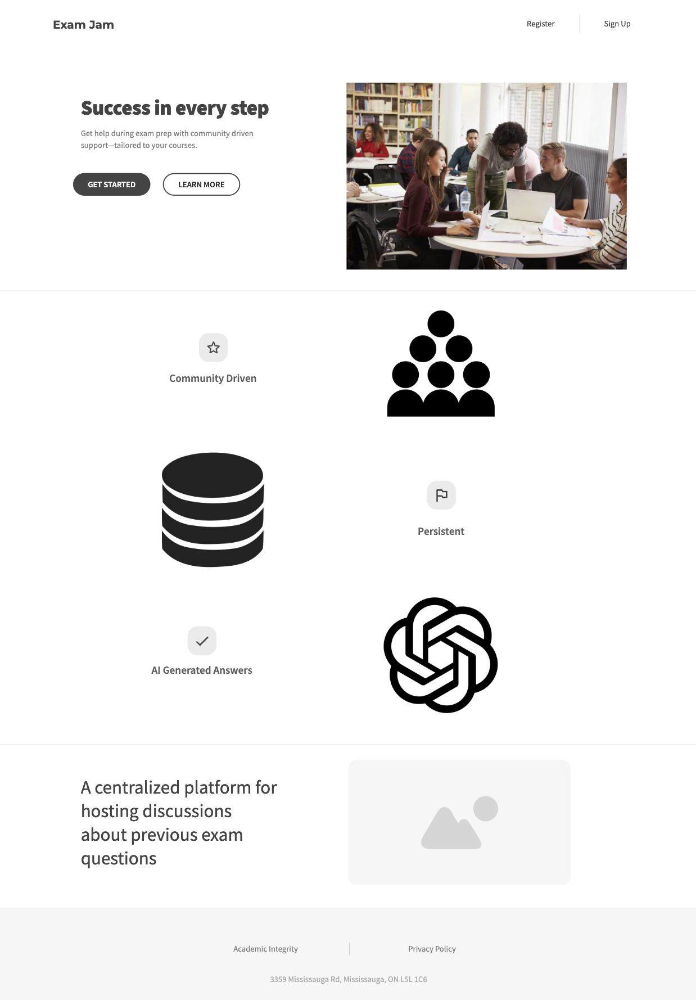
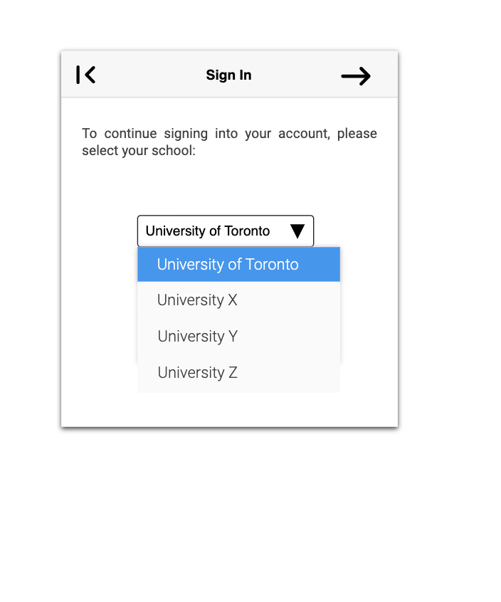
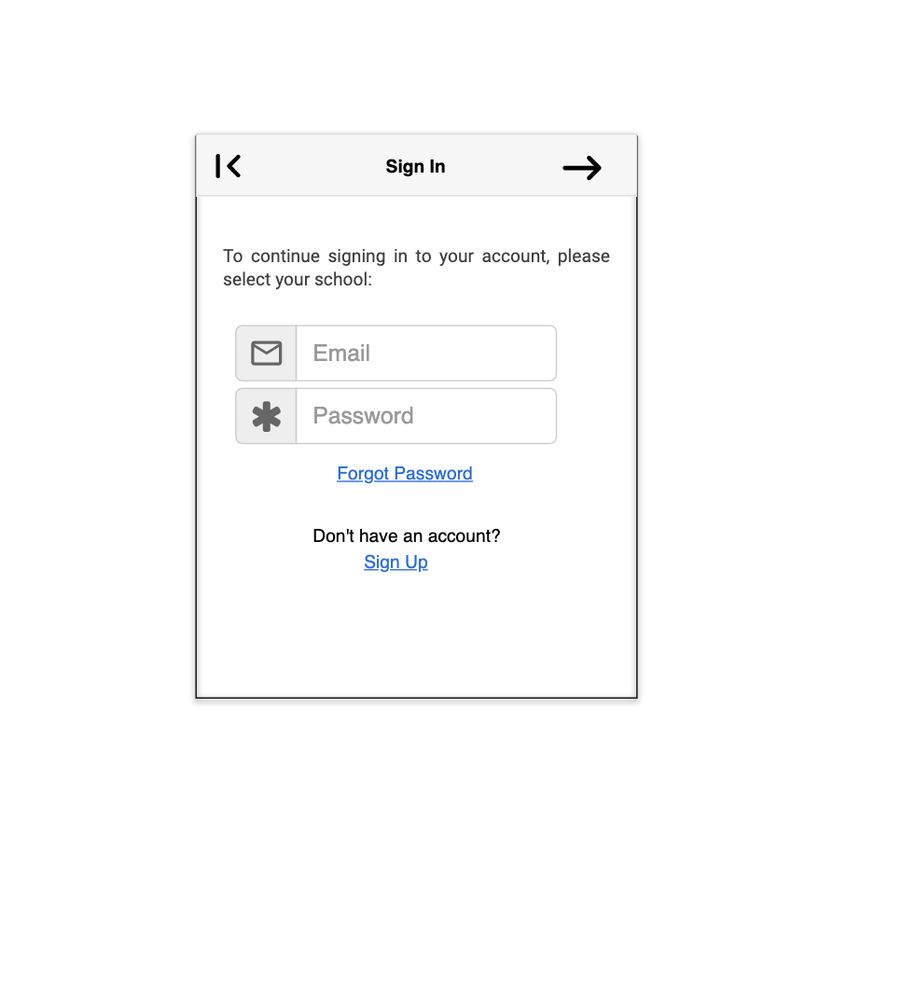
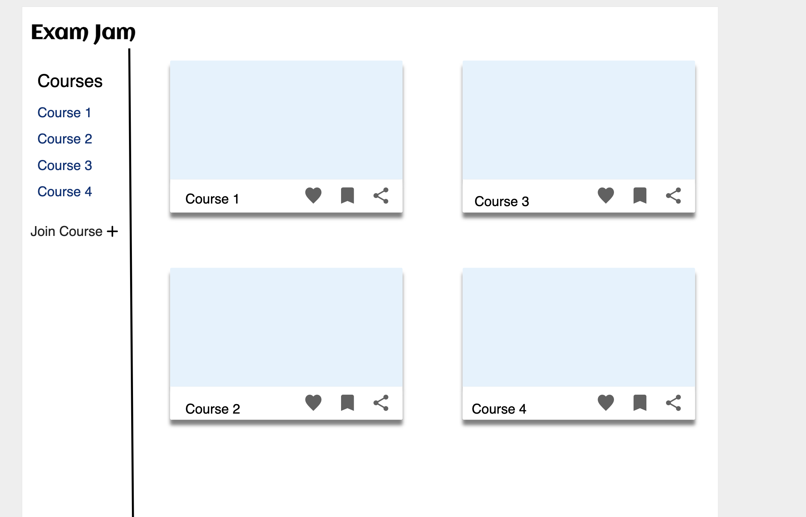
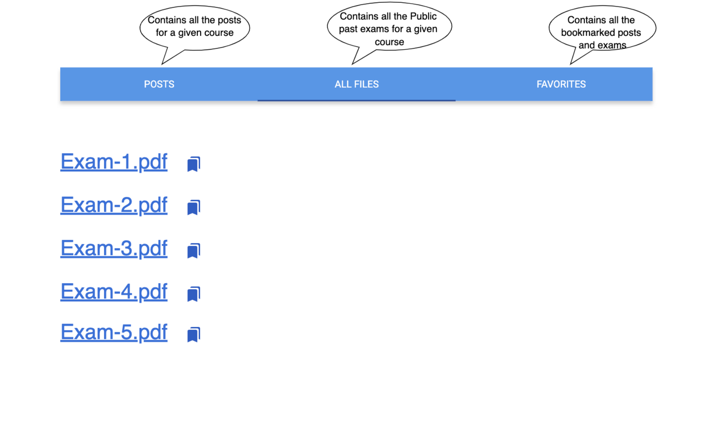
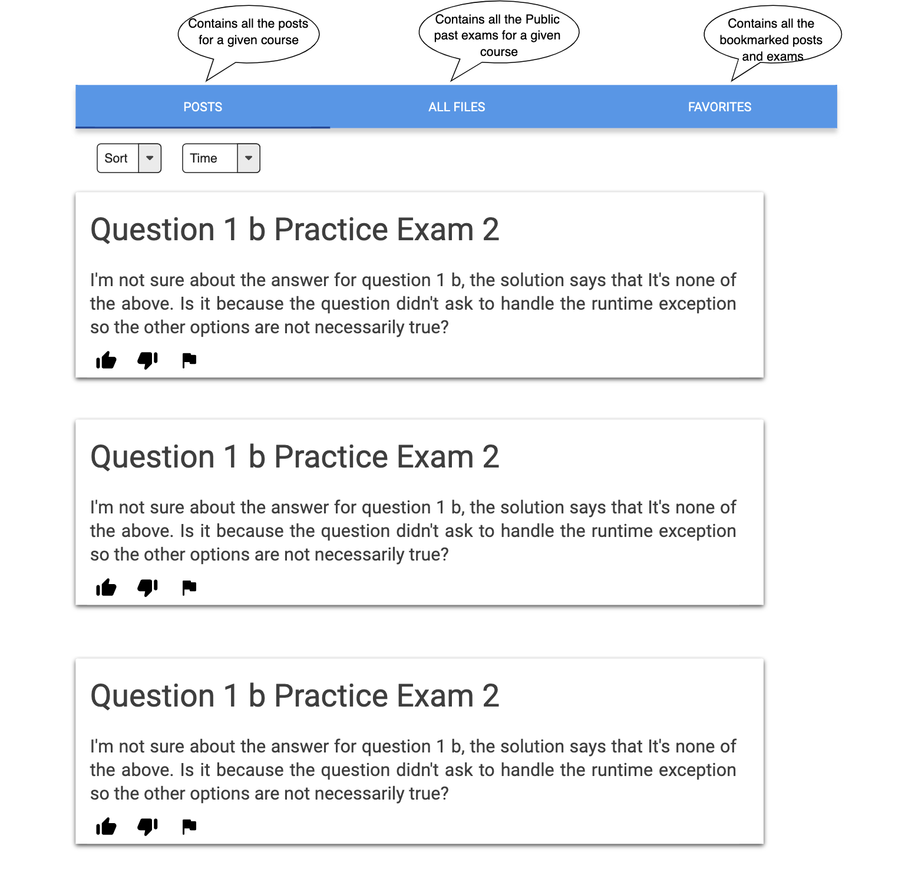
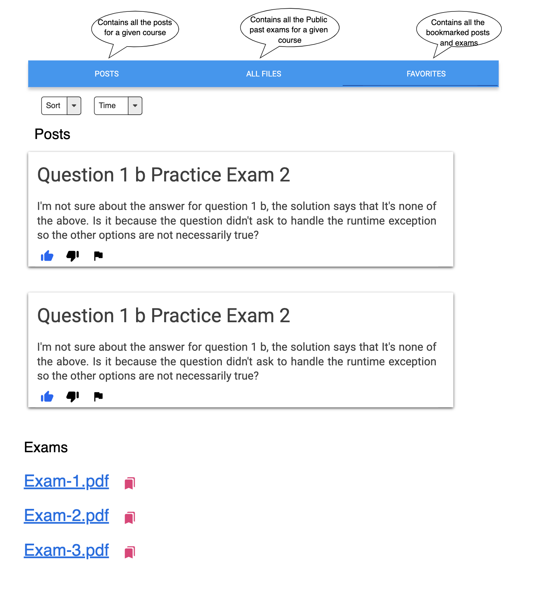
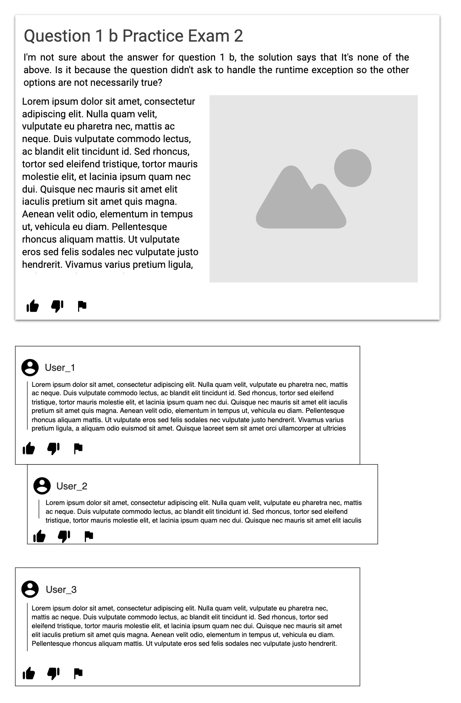

# User Interface

## Landing Page

## Sign In

## Dashboard

The following the main dashboard after a user signs in:

## Course Page

The following an example of what a user may see when they search for a specific course.
There are 3 categories. All Files, Posts, and Favourites. All Files, Favourites, and Posts have a mockup.

## Exam Page

The following is an example of what a user may see when they click on an past exam for a particular course:

