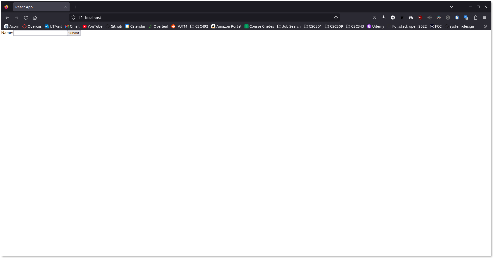
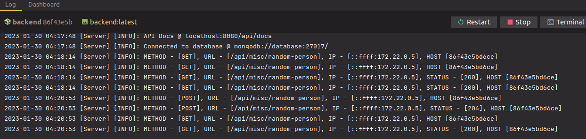
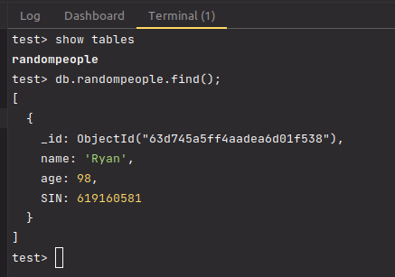
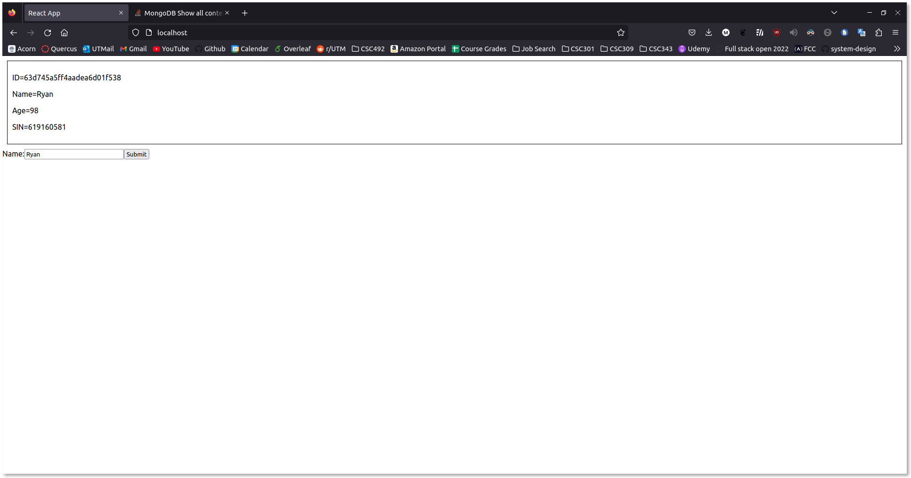

# Initial Setup

- Setup template backend
    - Includes a few dummy endpoints
      - `GET misc/ping`
      - `POST misc/random-person`
      - `GET misc/random-person`
    - Includes swagger documentation (autogenerated by TSOA library)
- Setup frontend
    - Initialized using create-react-app
    - Created a simple form that will send a request to the backend to create an object in the database.
    - Displays such objects via GET request
    - init storybook for documentation
- Setup dev environments
    - Added `env` files
    - docker and docker compose
      - Separate services for backend, frontend, and database
      - Live/hot reloading enabled using nodemon and service volumes
    - Makefile
      - A few common docker compose commands for quality of life
    - Nginx as reverse proxy

## Proof of Connection

When launching the app for the first time, the page will look something like this:

Filling out the text field and clicking submit will send a POST request to the backend:

The backend will then create a document in the database:

Finally, the frontend will query for all `randompeople` documents and render them:
